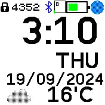

# Weather Clock 2

A clock (based on Weather Clock by James Gough).

This version retrieves the current location from the _My Location_ bangle.js app. and communicates directly with the open-meteo.com API. 
Contrast to the original _Weather Clock_ it does not need the bangle.js _Weather_ app. and a helper weather client app to be installed on your phone.

## Requirements

**This clock requires Gadgetbridge (with _Allow Internet Access_ enabled) on your phone and the _My Location_ app on bangle.js in order to get weather data.**

See the [Bangle.js Gadgetbridge documentation](https://www.espruino.com/Gadgetbridge) for instructions.

## Creator

George Samartzidis
